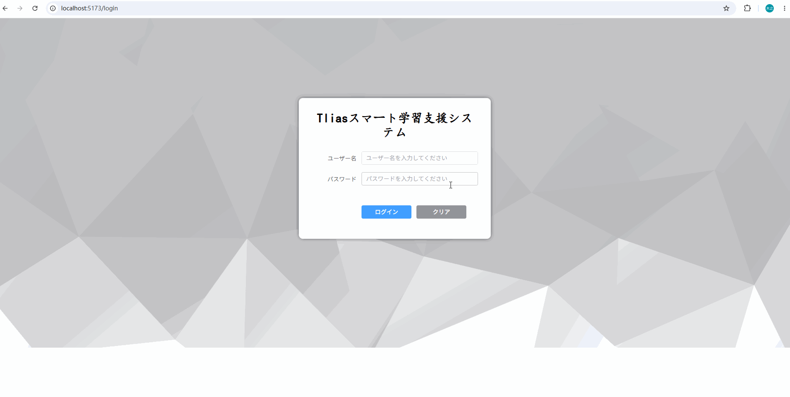
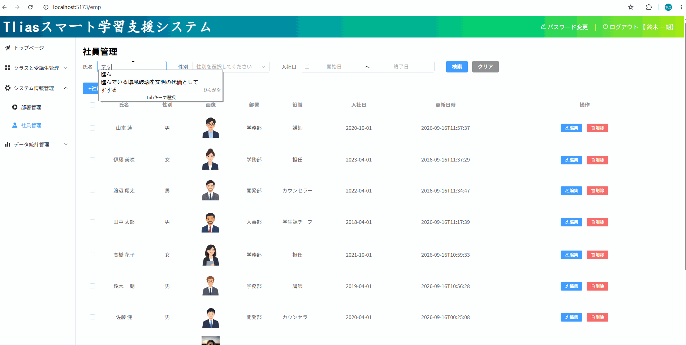
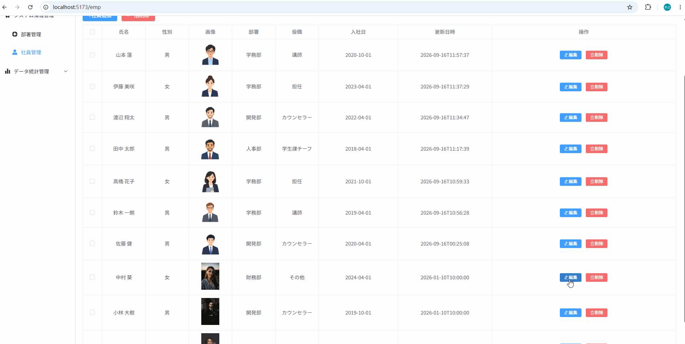
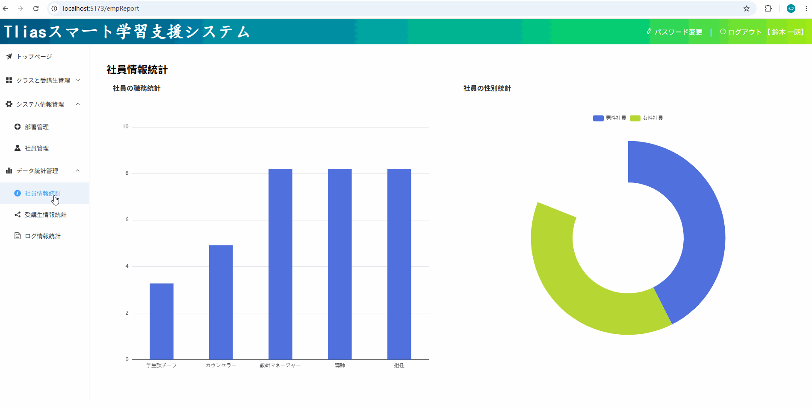
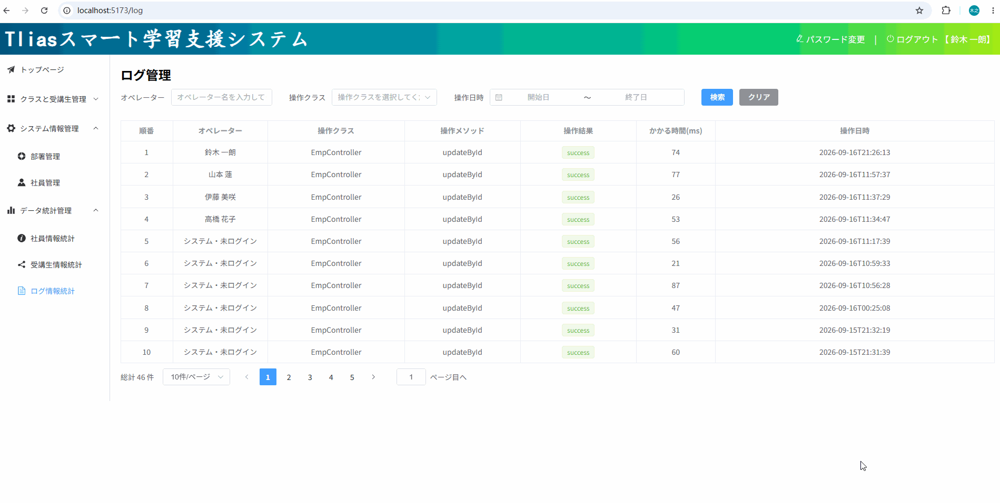

# 🏢 Tlias 従業員管理システム - バックエンド (Tlias Employee Management System - Backend)

Vue 3 + Spring Boot 前后端分離型の従業員管理システムのバックエンドAPIサービスです。
RESTful API 設計に基づき、多層アーキテクチャとマルチモジュール構成を採用して設計・開発されています。

---

## 📸 画面デモ (System Screenshots & Demo)

### 1. ログイン処理 & JWT認証 (Login & JWT Authentication)


### 2. 従業員一覧・検索 & ページネーション (Employee Query & Pagination)


### 3. 画像アップロード & クラウドストレージ連携 (File Upload & OSS Integration)


### 4. データ統計 & 可視化ダッシュボード (Data Statistics & Visualization)


### 5. AOP操作ログ記録 (AOP Operation Logging)


---

## 🛠️ 技術スタック (Tech Stack)

- **コアフレームワーク**: Spring Boot 4.x
- **永続層フレームワーク**: MyBatis 4.x
- **データベース**: MySQL 8.0
- **プログラミング言語**: Java 17 
- **ビルドツール**: Maven (マルチモジュール継承構成)
- **サードパーティサービス & ユーティリティ**:
    - **Lombok**: ボイラープレートコード（Getter/Setter等）の削減
    - **JJWT (JSON Web Token)**: 無状態（Stateless）認証・認可
    - **Alibaba Cloud OSS**: 顔写真のクラウドストレージ保存

---

## 🏗️ システムアーキテクチャ & 設計 (Architecture & Design)

### 1. 3層アーキテクチャ (Three-Tier Architecture)
明確な関心の分離（SoC）を実現するため、標準的な3層構造を採用しています：
- **Controller Layer (コントローラー層)**: HTTPリクエストの受け取り、パラメータ検証、レスポンスの返却
- **Service Layer (ビジネスロジック層)**: 業務ロジックの処理、トランザクション管理
- **Mapper/DAO Layer (データアクセス層)**: MyBatisを通じたデータベース操作 (CRUD)

### 2. Maven マルチモジュール構造 (Multi-Module Configuration)
コードの再利用性とメンテナビリティ向上のため、親モジュール (`parent`) による依存関係管理とモジュール分割を行っています：
- `tlias-parent`: プロジェクト全体の依存バージョンとビルド設定を一括管理
- `tlias-pojo`: エンティティクラス (Entity)、DTO、VO の定義
- `tlias-utils`: JWT処理、OSSファイルアップロードなどの共通ユーティリティ
- `DepartmentManage`: コントローラー、サービス、ビジネスロジックの実装

---

## 🔐 セキュリティ & コア機能の実装 (Core Features & Highlights)

### 1. リクエストフィルタリング & 認証 (Filter & Interceptor)
- **認証メカニズム**: JWT トークンによるリクエスト検証。
- **柔軟な制御**: フィルタ (`Filter`) と インターセプター (`Interceptor`) の両方を実装し、本番環境ではインターセプターをアクティブ化して細かなパス制御を実現。
- **ThreadLocal によるコンテキスト保持**: ログインユーザーのID情報を `ThreadLocal` に保持し、リクエストのライフサイクル全体で安全にユーザー情報を共有・取得。

### 2. AOP & カスタムアノテーションによる操作ログ記録 (AOP & Custom Annotations)
- **カスタムアノテーション**: `@Log` アノテーションを独自定義。
- **アスペクト指向プログラミング (AOP)**: 操作ログ追跡アスペクトを実装し、特定の操作（追加・更新・削除など）が行われた際、実行時間、操作ユーザーID (`ThreadLocal` から取得)、メソッド引数、戻り値を自動的にデータベースのログテーブルに記録。

### 3. グローバル例外ハンドリング (Global Exception Handling)
- `@RestControllerAdvice` と `@ExceptionHandler` を使用して、システム全体で発生した例外を一元的にキャッチ。
- ビジネス例外やシステムエラーを統一されたレスポンスフォーマット (`Result`) に変換してフロントエンドに返却。

---

## 🚀 ローカルでの起動手順 (Getting Started)

### 前提条件
- JDK 17+
- MySQL 8.0+
- Maven 3.8+

### 設定手順
1. **リポジトリのクローン**
   ```bash
   git clone [https://github.com/YeungSann/web-tlias-project.git](https://github.com/Yen/web-tlias-project.git)
   cd web-tlias-project
2. **データベースの準備**
    ```bash
    MySQL に tlias データベースを作成し、付属の tlias.sql スクリプトを実行します。

3. **環境変数の設定 (重要)**
    ```bash
    本プロジェクトではセキュリティのベストプラクティスに従い、OSSアクセスキー等の機密情報を環境変数から取得します。

    OS環境変数に以下を設定してください：

    ALIBABA_CLOUD_ACCESS_KEY_ID: Alibaba Cloud OSS AccessKey ID

    ALIBABA_CLOUD_ACCESS_KEY_SECRET: Alibaba Cloud OSS AccessKey Secret

4. **設定ファイルの調整**
    ```bash
    tlias-web/src/main/resources/application.yml 内の MySQL 接続情報（username / password）をローカル環境に合わせて変更してください。

5. **プロジェクトのビルド & 起動**
    ```bash
    mvn clean install
   tlias-web モジュールの TliasApplication.java を実行します。